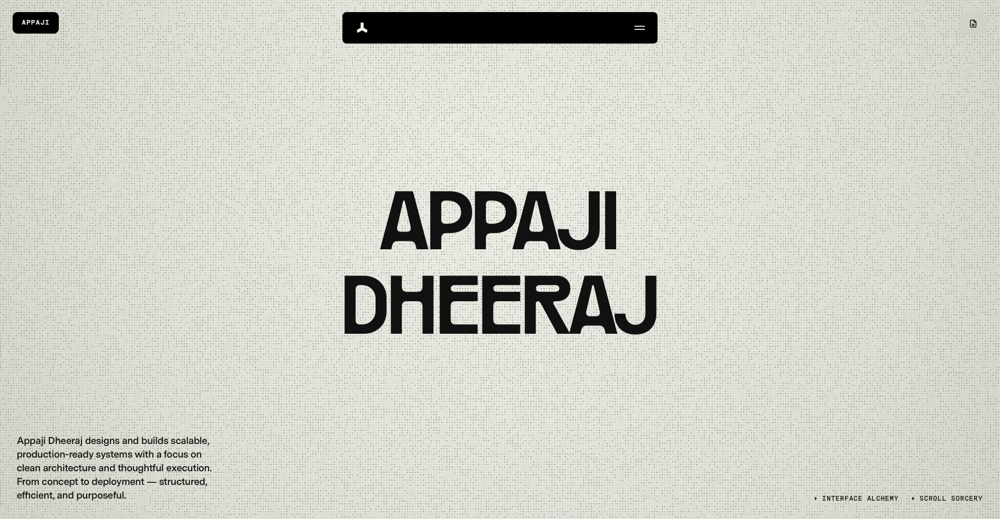

# dheerajbuilds.com — Portfolio & Template

> A minimal, motion-rich personal portfolio built with React + Vite. Designed to be fast, expressive, and easy to make your own.



---

## ✨ Features

- **Smooth scroll & animations** — powered by [Lenis](https://lenis.darkroom.engineering/), [GSAP](https://gsap.com/), and [Framer Motion](https://www.framer.com/motion/)
- **Multi-page SPA** — Home, Work, About, Contact, FAQ, and individual Project pages via React Router
- **Contact form with email delivery** — serverless `/api/contact` function using [Resend](https://resend.com/)
- **Bot protection** — honeypot field on the contact form
- **Vercel-ready** — one-click deploy with correct SPA + API routing out of the box
- **Analytics & performance** — Vercel Analytics and Speed Insights pre-wired
- **Centralised data layer** — all copy, navigation, projects, FAQs, and reviews live in `src/data/` — swap your content without touching UI code

---

## 🗂️ Project Structure

```
.
├── api/                    # Vercel serverless functions (contact endpoint)
├── public/                 # Static assets (images, fonts, resume PDF)
├── src/
│   ├── components/         # Reusable UI components (NavBar, Footer, animations, …)
│   ├── data/               # All site content — edit here to personalise
│   ├── pages/              # Route-level page components
│   └── utils/              # Shared utilities
├── templates/              # Email & form-response HTML templates
├── .env.example            # Environment variable reference
├── vercel.json             # Vercel routing config
└── vite.config.js
```

---

## 🚀 Getting Started

### 1. Clone the repo

```bash
git clone https://github.com/AppajiDheeraj/dheerajbuilds.com.git
cd dheerajbuilds.com
```

### 2. Install dependencies

```bash
npm install
```

### 3. Configure environment variables

```bash
cp .env.example .env
```

Open `.env` and fill in your values:

| Variable | Description |
|---|---|
| `RESEND_API_KEY` | API key from [resend.com](https://resend.com) |
| `CONTACT_TO_EMAIL` | Inbox where contact messages are delivered |
| `CONTACT_FROM_EMAIL` | Verified sender identity (e.g. `Portfolio <hello@yourdomain.com>`) |
| `EMAIL_ASSET_BASE_URL` | Base URL for email template images |
| `EMAIL_FORM_RESPONSE_ASSET_BASE_URL` | Base URL for form-response template images |

### 4. Run locally

```bash
# Frontend only
npm run dev

# Frontend + API (contact form)
vercel dev
```

---

## 🧩 Using This as a Template

This project is **built to be forked and personalised**. All site content is centralised in a single config file — no hunting through components.

### Steps to make it yours

1. **Update your identity** — open `src/data/index.js` and edit the `person` object (name, email) and `siteConfig` (URLs, descriptions, social links).
2. **Add your projects** — edit `src/data/projects.js` and `src/data/workList.js`.
3. **Swap images** — replace assets in `public/` (hero images, project shots, logos, resume PDF).
4. **Edit copy** — every page's headline, description, and meta lives in `siteConfig` in `src/data/index.js`.
5. **Update FAQs & reviews** — edit `src/data/faqs.js` and `src/data/reviews.js`.
6. **Set your domain** — update `siteUrl` in `src/data/index.js` and configure your domain in Vercel.

> You do **not** need to touch any component files to fully personalise the site.

---

## 📬 Contact Form Backend

The serverless function at `/api/contact`:

- Accepts `POST` requests with `name`, `email`, and `message` fields
- Validates required fields and rejects obvious bot submissions via a honeypot
- Sends a notification email to `CONTACT_TO_EMAIL` and an auto-reply to the sender through Resend

### Deployment notes

- `vercel.json` uses filesystem-first routing so `/api/*` functions are always served correctly.
- All other routes fall through to the React SPA (`/`).

---

## 🛠️ Tech Stack

| Layer | Technology |
|---|---|
| Framework | [React 19](https://react.dev/) + [Vite 6](https://vitejs.dev/) |
| Routing | [React Router 7](https://reactrouter.com/) |
| Animation | [GSAP](https://gsap.com/), [Framer Motion](https://www.framer.com/motion/), [Lenis](https://lenis.darkroom.engineering/) |
| Icons | [Lucide React](https://lucide.dev/), [React Icons](https://react-icons.github.io/react-icons/) |
| Email | [Resend](https://resend.com/) |
| Deployment | [Vercel](https://vercel.com/) |
| Analytics | Vercel Analytics + Speed Insights |

---

## 📦 Deployment

[](https://vercel.com/new/clone?repository-url=https://github.com/AppajiDheeraj/dheerajbuilds.com)

1. Click the button above (or import the repo manually in Vercel).
2. Add the required environment variables in your Vercel project settings.
3. Deploy — done.

---

## 📄 License

Feel free to fork, adapt, and use this as a template for your own portfolio. A credit or a star is always appreciated. 🙌